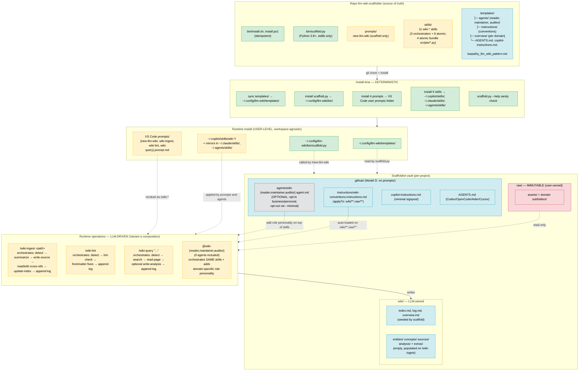
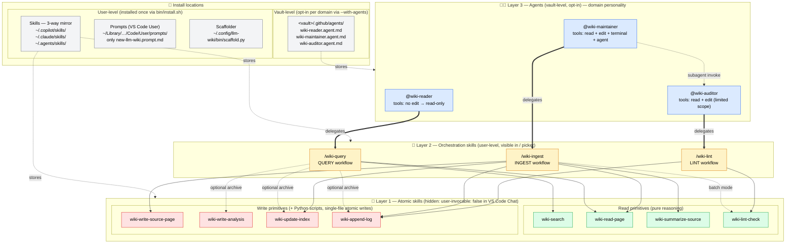

# Architecture

Design overview of `llm-wiki-scaffolder`. Complementary to [README.md](README.md) (user-facing) — this document is for contributors and future maintainers.

For discrete design decisions with alternatives considered, see [docs/decisions/](docs/decisions/).

## One-line summary

> Everything that can be reduced to *"copy files + substitute placeholders + detect state"* is deterministic (Python/Bash). Everything that requires semantic judgment is delegated to the LLM, guided by roles and workflows written into the templates.

The boundary is drawn intentionally: reproducibility on the scaffold side, freedom of synthesis on the wiki side.

## Unified diagram (build-time + runtime)

> **Model D architecture** (adopted 2026-07 per [ADR-0009](docs/decisions/0009-evaluate-user-level-vault-operational-customizations.md)). Prompts and skills live at **user level** (workspace-agnostic); agents are **optional per vault** (opt-in for `business`/`personal` domains, opt-out via `--minimal`).

**Color legend:** green = deterministic · yellow = LLM-driven · blue = template/data · red = immutable (Karpathy invariant) · grey = optional per-vault

## The five layers

(Increased from four layers in the original design to five under Model D: the **Skills layer** was extracted from what used to be embedded in vault-level prompts. See [ADR-0009](docs/decisions/0009-evaluate-user-level-vault-operational-customizations.md).)

### 1. Distribution layer — [bin/install.sh](bin/install.sh)

**What it does (100% deterministic):**
- Syncs `templates/` bidirectionally to `~/.config/llm-wiki/templates/` (`rsync --delete` on Unix, `Copy-Item` on Windows) — files removed from the repo also disappear from the runtime copy.
- Installs `scaffold.py` (`0755`) to `~/.config/llm-wiki/bin/`.
- Installs 4 user-level prompts (`0644`) — `new-llm-wiki`, `wiki-ingest`, `wiki-lint`, `wiki-query` — to the VS Code user prompts folder.
- Installs the 11 wiki-* skills (3 orchestration + 8 atomic) to three destinations: `~/.copilot/skills/`, `~/.claude/skills/`, `~/.agents/skills/` (for cross-tool composability with Copilot CLI, Claude Code, and other agent runtimes).
- Cross-platform detection of the VS Code prompts folder (macOS/Linux/Windows, stable/Insiders).
- Legacy cleanup: removes obsolete VS Code prompts (`new_llm_wiki_vault.prompt.md`) and any vault-level `.github/prompts/wiki-*.prompt.md` on `--upgrade` (these lived at vault level pre-Model D).
- Sanity check: `scaffold.py --help` must run cleanly.

**Why deterministic:**
- Pure filesystem I/O. Zero ambiguity → no LLM needed.
- `rsync --delete` guarantees that *updating* is identical to *installing from scratch*: no accumulated runtime state in `~/.config/llm-wiki/`. Contract stated in [README.md](README.md): *"edit the repo, not the runtime copy."*

**Why user-level (installed once):**
- All 4 slash-commands + 9 skills must exist *before* a workspace-vault exists, and must work from *any* workspace that contains a vault. So they go into VS Code User/prompts and `~/.copilot/skills/`, not `.github/prompts/` or `.github/skills/`.
- Trade-off documented in [ADR-0002](docs/decisions/0002-user-level-prompt-not-skill.md) (original scaffold-only decision) and [ADR-0009](docs/decisions/0009-evaluate-user-level-vault-operational-customizations.md) (Model D generalization).

### 2. Scaffold layer — [bin/scaffold.py](bin/scaffold.py)

**What it does (100% deterministic, Python stdlib):**
- **State detection** (`--detect-only --json`): recognizes `absent | existing_llm_wiki | existing_non_wiki` by looking for the marker `"LLM Wiki"` in `.github/copilot-instructions.md`. Also returns a `domain_type_hint` for wizard pre-selection.
- **Placeholder substitution**: `{{PROJECT_NAME}}`, `{{DOMAIN_TYPE}}`, `{{DOMAIN_SPECIFIC_CONVENTIONS}}`, `{{LANGUAGE}}`, `{{DOMAIN_EXTRA_TYPES}}` — plain text substitution.
- **Domain routing**: `DOMAIN_CONFIGS` dict maps `type` → `(raw_folders, extra_wiki_folders, extra_page_types, overview_template, conventions_text)`.
- **Karpathy invariants enforced by code**, not by the LLM:
  - `raw/` is never overwritten (explicit block).
  - `wiki/` content folders stay empty with `.gitkeep` — never filled by the scaffold.
  - `.github/copilot-instructions.md` stays a minimal signpost.
- Three modes: `fresh | --force | --upgrade`. Only `--upgrade` is non-destructive and fills *only* missing files under `.github/`.
- Structured output: `--json-out` returns `{status, files_created, files_overwritten, files_skipped, seed_path_final, ...}` — machine-readable, consumable by the LLM orchestrator.

**Why deterministic, stdlib-only:**
- **Reproducibility.** Two runs with identical flags produce byte-identical output. Critical for `--upgrade`: an LLM-driven scaffolder would risk introducing subtle drift that would require manual diffing to catch.
- **Zero runtime dependency.** Python 3.8 is everywhere on macOS/Linux. No `pip install`. Adoption barrier = clone the repo.
- **Clear risk boundary.** An LLM scaffolder might "helpfully" pre-populate `wiki/entities/` — violating the Karpathy invariant that *the wiki is compounded from sources, not pre-filled*. The code cannot do that by construction.

Rationale detailed in [ADR-0001](docs/decisions/0001-python-stdlib-only.md) and [ADR-0003](docs/decisions/0003-deterministic-scaffold-llm-fill.md).

### 3. Orchestration layer — [prompts/new-llm-wiki.prompt.md](prompts/new-llm-wiki.prompt.md)

**What it does (LLM-driven, tightly bounded):**
- Parses inline flags from the user's message.
- Calls `vscode_askQuestions` **only** for missing parameters (avoids re-asking what was already passed).
- Invokes `scaffold.py --detect-only` to understand the target path state, then `scaffold.py --json-out` for the real work.
- Post-scaffold: fills 4–5 project-specific seed questions in `wiki/overview.md` (the one thing a script cannot generate well: it requires domain judgment).
- Optionally appends a short "Domain notes" section to one agent file, per a fixed table.

**Why hybrid:**
- The *dispatch* (parse intent, map to flags) is natural for an LLM: users speak in NL, not flags.
- The *heavy work* (creating dirs, substituting placeholders) is delegated to the script for the reasons above.
- The *semantic fill* (project-specific seed questions) stays with the LLM: there is no deterministic way to write good questions for e.g. an "LOTR reading fiction" vault — it requires domain understanding.

**Hard constraints written into the prompt** (redundant with `scaffold.py` enforcement, kept as belt-and-suspenders):
- Never write into `raw/`.
- Never write into `wiki/` content folders.
- Never grow `copilot-instructions.md`.
- Never create new agents.

### 4. Skills layer (NEW under Model D) — [skills/](skills/)

**What it is:** 11 user-level capabilities packaged as `SKILL.md` files, organized in two sub-layers per [ADR-0012](docs/decisions/0012-orchestration-skills-and-agent-delegation.md):

**Orchestration skills** (3, visible in `/` picker): compose atomic skills into canonical workflows. These replace the earlier `/wiki-ingest`, `/wiki-lint`, `/wiki-query` prompts (see [ADR-0007](docs/decisions/0007-ingest-lint-remain-prompts.md) erratum).

| Skill | Purpose |
|---|---|
| `wiki-ingest` | Full INGEST workflow: summarize → write source page → cross-refs → index → log. Single-source + batch (folder) modes. |
| `wiki-query` | Full QUERY workflow: search → read pages → synthesize with `[[wikilink]]` citations → optional archival. |
| `wiki-lint` | Full LINT workflow: run 7 audits (MD + JSON) → auto-repair unambiguous frontmatter → log. |

**Atomic skills** (8, hidden from `/` picker via `user-invocable: false`): single-purpose primitives composed by orchestrators and agents. Four bundle a stdlib-only Python script under `scripts/` for single-file, blast-radius-bounded write operations. The vault path is not detected — it is read from the auto-loaded `.github/copilot-instructions.md` under `## Vault / **Path:**` (see [ADR-0010](docs/decisions/0010-eliminate-wiki-detect-vault.md)) and passed as `vault_path` argument to every skill by the caller.

| Skill | Kind | Purpose |
|---|---|---|
| `wiki-search` | pure reasoning | Rank pages in `wiki/index.md` by relevance |
| `wiki-read-page` | pure reasoning | Read a wiki page with parsed frontmatter + wikilinks |
| `wiki-summarize-source` | pure reasoning | Produce a structured summary of a `raw/` source |
| `wiki-lint-check` | pure reasoning | Health-check the wiki (JSON or MD report) |
| `wiki-write-source-page` | + Python script | Create one `wiki/sources/<slug>.md` from a summary |
| `wiki-write-analysis` | + Python script | Create one `wiki/analysis/<slug>.md` from a synthesis |
| `wiki-update-index` | + Python script | Add/update one row in `wiki/index.md` |
| `wiki-append-log` | + Python script | Append one entry to `wiki/log.md` |

**Why user-level and atomic:**
- **Composability**: the same skill is consumable by user-level prompts (`/wiki-ingest`, `/wiki-lint`, `/wiki-query`), by vault-level agents (`@wiki-maintainer` etc.), and by external tools (Copilot CLI, Claude Code, OpenSpec workflows).
- **Blast-radius safety**: each write skill touches exactly one file. A misbehaving script can damage exactly one page — not the whole wiki.
- **DRY**: prompts and agents both orchestrate the same skills (Variant α composition, per [ADR-0009](docs/decisions/0009-evaluate-user-level-vault-operational-customizations.md)). No duplicated workflow logic.

**Why stdlib-only scripts:**
Same rationale as the scaffolder ([ADR-0001](docs/decisions/0001-python-stdlib-only.md)) — zero runtime dependency, reproducibility, portability.

## Skills call graph and install topology

Detailed view of the 3-layer architecture (per [ADR-0012](docs/decisions/0012-orchestration-skills-and-agent-delegation.md)) — which orchestration skill composes which atomic primitives, which agent delegates to which orchestration skill, and where each artifact is installed on disk.

**Legend**

| Arrow | Meaning |
|---|---|
| `==>` (thick) | **Delegation** — agent forwards to orchestration skill |
| `-.subagent invoke.->` | Maintainer invokes auditor as subagent (post batch-ingest) |
| `-->` | **Composition** — orchestration skill applies atomic skill (always) |
| `-.optional/batch.->` | Conditional composition (opt-in archive, batch-only lint) |
| `-.stores.->` | **Install location** — where the file physically lives on disk |

**Composition summary**

- `/wiki-query` → `wiki-search` + `wiki-read-page` (always) + `wiki-write-analysis` + `wiki-update-index` + `wiki-append-log` (opt-in with `--archive`)
- `/wiki-ingest` → `wiki-summarize-source` + `wiki-write-source-page` + `wiki-read-page` (cross-refs) + `wiki-update-index` + `wiki-append-log` (always) + `wiki-lint-check` (batch mode only)
- `/wiki-lint` → `wiki-lint-check` (JSON + MD, 2 invocations) + `wiki-append-log`

**Not shown** (kept off the graph for clarity)

- Platform tools (`replace_string_in_file`, `create_file`, `read_file`) used directly by orchestration skills for content edits (cross-refs, frontmatter fixes) — these are not skills.
- Auto-loaded `.github/instructions/wiki-conventions.instructions.md` (fires on any `wiki/**` or `raw/**` file edit, indirectly applying domain rules regardless of orchestrator).

### 5. Vault runtime layer — LLM-driven

Once scaffolded, the vault operates with 1 user-level slash-prompt (`/new-llm-wiki`) + 11 user-level skills (3 orchestration + 8 atomic) + (optionally) 3 vault-level role agents that delegate to the orchestration skills. See [ADR-0012](docs/decisions/0012-orchestration-skills-and-agent-delegation.md) for the 3-layer composition rationale.

| Component | Level | Type | Executed by | Determinism |
|---|---|---|---|---|
| `wiki-conventions.instructions.md` | vault | Instructions (`applyTo`) | LLM auto-loads on `wiki/**` and `raw/**` | Static, pattern-matched |
| 8 atomic wiki-* skills | user | Skill (playbook, some with scripts) | LLM applies when explicitly invoked by orchestrator/agent (`user-invocable: false`) | Python scripts deterministic; playbook parts LLM |
| `wiki-ingest` skill | user | Orchestration skill | LLM via `/wiki-ingest` (or auto-invoke on natural language) | INGEST workflow |
| `wiki-lint` skill | user | Orchestration skill | LLM via `/wiki-lint` | LINT workflow |
| `wiki-query` skill | user | Orchestration skill | LLM via `/wiki-query` | QUERY workflow |
| `new-llm-wiki.prompt.md` | user | Slash prompt | LLM (calls scaffold.py) | Explicit ritual, pre-vault only |
| `wiki-reader.agent.md` | vault (opt) | Agent role | LLM via `@wiki-reader`; delegates to `wiki-query` skill | Runtime-enforced read-only (`tools:` no `edit/editFiles`) |
| `wiki-maintainer.agent.md` | vault (opt) | Agent role | LLM via `@wiki-maintainer`; delegates to `wiki-ingest` skill | Full `edit/editFiles`+terminal; can dispatch `@wiki-auditor` |
| `wiki-auditor.agent.md` | vault (opt) | Agent role | LLM via `@wiki-auditor` or as subagent; delegates to `wiki-lint` skill | `edit/editFiles` for callouts + frontmatter fixes only (body-enforced no-create) |

**Why LLM-driven here:**
- Runtime operations (ingest, query, lint) require irreducible semantic judgment: identifying entities, cross-references, contradictions, coverage gaps. A script cannot do this.
- The Karpathy pattern explicitly prescribes that *"the LLM writes and maintains all of [the wiki]"* — it is the premise of the whole idea.

**How non-determinism is controlled:**
- **Auto-loaded instructions** (`applyTo: "wiki/**,raw/**"`) enforce canonical frontmatter, `snake_case`, Obsidian syntax, `raw/` immutability. Every write goes through them.
- **Hard-constrained agents**: reader is read-only (except `wiki/analysis/`); auditor cannot edit content (only frontmatter and meta callouts); maintainer never touches `raw/`. Enforced under `## Constraints` in each file.
- **Numbered workflows**: steps are explicit (INGEST 1–8, LINT 1–7), not "guidelines". Reduces cross-session variance.
- **Append-only log** at `wiki/log.md` with standardized prefixes (`## [YYYY-MM-DD] ingest | ...`) — grep-able with unix tools, serves both as LLM memory across sessions and as human audit trail.

## Prompt vs Agent — invocation model

Full rationale in [ADR-0005](docs/decisions/0005-prompt-vs-agent-invocation.md). Practical rule:

| Situation | Tool |
|---|---|
| "Add *this* source to the wiki" | `/wiki-ingest <path>` |
| "Run periodic health check" | `/wiki-lint` |
| "Discuss before writing, or perform a non-ingest maintenance op" | `@wiki-maintainer` |
| "Audit only *these* pages / *this* aspect" | `@wiki-auditor` |
| "Ask a question against the wiki" | `@wiki-reader` (no slash equivalent — see [ADR-0006](docs/decisions/0006-no-wiki-query-slash.md)) |

**Prompt = verb (canonical operation).** Slash-command with `argument-hint` and explicit ritual. If you would log the action as `## [date] ingest \| ...` or `## [date] lint \| ...`, use a slash-command.

**Agent = subject (role).** Mention-based, conversational, flexible. Use when the operation is off the standard workflow or requires multi-turn negotiation.

## Determinism/LLM boundary — summary table

| Phase | Component | Determinism | Why |
|---|---|---|---|
| Install | `install.sh` | Deterministic | Pure filesystem I/O |
| Install | Template sync via rsync | Deterministic | Idempotence guaranteed |
| Scaffold | State detection | Deterministic | File marker + JSON out |
| Scaffold | Directory creation | Deterministic | `Path.mkdir` on fixed pattern |
| Scaffold | Placeholder substitution | Deterministic | `str.replace` |
| Scaffold | Domain routing | Deterministic | Dict lookup |
| Scaffold | Karpathy invariants | Deterministic | Enforced with `if/raise` |
| Orchestration | Intent parsing | LLM | Natural for NL input |
| Orchestration | Wizard questions | LLM | Wraps `vscode_askQuestions` |
| Orchestration | Seed questions in overview | LLM | Requires domain judgment |
| Orchestration | Script delegation | Deterministic (LLM-triggered) | LLM calls, script executes |
| Runtime | Ingest workflow | LLM (workflow-guided) | Synthesis + cross-ref = irreducible |
| Runtime | Query workflow | LLM (workflow-guided) | Answer synthesis |
| Runtime | Lint checks | LLM (checklist-guided) | Semantic contradictions, orphans |
| Runtime | Frontmatter repair | LLM under rules | "Auto only if unambiguous" |
| Runtime | `raw/` immutability | Invariant | Enforced in conventions + agent constraints |
| Runtime | Log append-only | LLM convention | Standard grep-able format |

General rule: **filesystem structure and naming = deterministic; semantic content inside pages = LLM with written guardrails.**

## Key design choices (index)

Each choice has a dedicated ADR under [docs/decisions/](docs/decisions/):

1. **Python stdlib only** — [ADR-0001](docs/decisions/0001-python-stdlib-only.md)
2. **User-level prompt, not skill** (original scaffold decision; generalized by ADR-0009) — [ADR-0002](docs/decisions/0002-user-level-prompt-not-skill.md)
3. **Deterministic scaffold + LLM fill split** — [ADR-0003](docs/decisions/0003-deterministic-scaffold-llm-fill.md)
4. **Three fixed roles** (reader/maintainer/auditor; roles remain, per ADR-0012 they become domain-personality layers) — [ADR-0004](docs/decisions/0004-three-fixed-roles.md)
5. **Prompt vs agent invocation model** — [ADR-0005](docs/decisions/0005-prompt-vs-agent-invocation.md)
6. **`/wiki-query` slash-command** (originally rejected in ADR-0006; added under Model D, now a skill) — [ADR-0006](docs/decisions/0006-no-wiki-query-slash.md)
7. **`/wiki-ingest` and `/wiki-lint` stay prompts** (superseded by ADR-0012 — now orchestration skills) — [ADR-0007](docs/decisions/0007-ingest-lint-remain-prompts.md)
8. **Windows support** — [ADR-0008](docs/decisions/0008-windows-support.md)
9. **Model D architecture: skills+prompts at user level, agents optional per vault (Variant α composition)** — [ADR-0009](docs/decisions/0009-evaluate-user-level-vault-operational-customizations.md)
10. **Eliminate wiki-detect-vault; vault path from copilot-instructions.md** — [ADR-0010](docs/decisions/0010-eliminate-wiki-detect-vault.md)
11. **Skill token optimization strategies (deferred)** — [ADR-0011](docs/decisions/0011-skill-token-optimization-strategies.md) (superseded by ADR-0010)
12. **Orchestration skills + agent delegation (3-layer architecture)** — [ADR-0012](docs/decisions/0012-orchestration-skills-and-agent-delegation.md)
