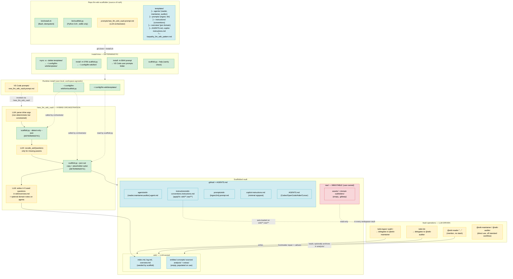

# Architecture

Design overview of `llm-wiki-scaffolder`. Complementary to [README.md](README.md) (user-facing) — this document is for contributors and future maintainers.

For discrete design decisions with alternatives considered, see [docs/decisions/](docs/decisions/).

## One-line summary

> Everything that can be reduced to *"copy files + substitute placeholders + detect state"* is deterministic (Python/Bash). Everything that requires semantic judgment is delegated to the LLM, guided by roles and workflows written into the templates.

The boundary is drawn intentionally: reproducibility on the scaffold side, freedom of synthesis on the wiki side.

## Unified diagram (build-time + runtime)

**Color legend:** green = deterministic · yellow = LLM-driven · blue = template/data · red = immutable (Karpathy invariant)

## The four layers

### 1. Distribution layer — [bin/install.sh](bin/install.sh)

**What it does (100% deterministic):**
- `rsync -a --delete templates/` — bidirectional sync; files removed from the repo also disappear from the runtime copy.
- Installs `scaffold.py` with `0755`, the prompt with `0644`.
- Cross-platform detection of the VS Code prompts folder (macOS/Linux, stable/Insiders).
- Sanity check: `scaffold.py --help` must run cleanly.

**Why deterministic:**
- Pure filesystem I/O. Zero ambiguity → no LLM needed.
- `rsync --delete` guarantees that *updating* is identical to *installing from scratch*: no accumulated runtime state in `~/.config/llm-wiki/`. Contract stated in [README.md](README.md): *"edit the repo, not the runtime copy."*

**Why user-level (installed once):**
- The `/new_llm_wiki_vault` slash-command must exist *before* a workspace-vault exists (it is what *creates* vaults). So it goes into `VS Code User/prompts/`, not `.github/prompts/`.
- Trade-off with Copilot skills (workspace-scoped only) documented in [ADR-0002](docs/decisions/0002-user-level-prompt-not-skill.md).

### 2. Scaffold layer — [bin/scaffold.py](bin/scaffold.py)

**What it does (100% deterministic, Python stdlib):**
- **State detection** (`--detect-only --json`): recognizes `absent | existing_llm_wiki | existing_non_wiki` by looking for the marker `"LLM Wiki"` in `.github/copilot-instructions.md`. Also returns a `domain_type_hint` for wizard pre-selection.
- **Placeholder substitution**: `{{PROJECT_NAME}}`, `{{DOMAIN_TYPE}}`, `{{DOMAIN_SPECIFIC_CONVENTIONS}}`, `{{LANGUAGE}}`, `{{DOMAIN_EXTRA_TYPES}}` — plain text substitution.
- **Domain routing**: `DOMAIN_CONFIGS` dict maps `type` → `(raw_folders, extra_wiki_folders, extra_page_types, overview_template, conventions_text)`.
- **Karpathy invariants enforced by code**, not by the LLM:
  - `raw/` is never overwritten (explicit block).
  - `wiki/` content folders stay empty with `.gitkeep` — never filled by the scaffold.
  - `.github/copilot-instructions.md` stays a minimal signpost.
- Three modes: `fresh | --force | --upgrade`. Only `--upgrade` is non-destructive and fills *only* missing files under `.github/`.
- Structured output: `--json-out` returns `{status, files_created, files_overwritten, files_skipped, seed_path_final, ...}` — machine-readable, consumable by the LLM orchestrator.

**Why deterministic, stdlib-only:**
- **Reproducibility.** Two runs with identical flags produce byte-identical output. Critical for `--upgrade`: an LLM-driven scaffolder would risk introducing subtle drift that would require manual diffing to catch.
- **Zero runtime dependency.** Python 3.8 is everywhere on macOS/Linux. No `pip install`. Adoption barrier = clone the repo.
- **Clear risk boundary.** An LLM scaffolder might "helpfully" pre-populate `wiki/entities/` — violating the Karpathy invariant that *the wiki is compounded from sources, not pre-filled*. The code cannot do that by construction.

Rationale detailed in [ADR-0001](docs/decisions/0001-python-stdlib-only.md) and [ADR-0003](docs/decisions/0003-deterministic-scaffold-llm-fill.md).

### 3. Orchestration layer — [prompts/new_llm_wiki_vault.prompt.md](prompts/new_llm_wiki_vault.prompt.md)

**What it does (LLM-driven, tightly bounded):**
- Parses inline flags from the user's message.
- Calls `vscode_askQuestions` **only** for missing parameters (avoids re-asking what was already passed).
- Invokes `scaffold.py --detect-only` to understand the target path state, then `scaffold.py --json-out` for the real work.
- Post-scaffold: fills 4–5 project-specific seed questions in `wiki/overview.md` (the one thing a script cannot generate well: it requires domain judgment).
- Optionally appends a short "Domain notes" section to one agent file, per a fixed table.

**Why hybrid:**
- The *dispatch* (parse intent, map to flags) is natural for an LLM: users speak in NL, not flags.
- The *heavy work* (creating dirs, substituting placeholders) is delegated to the script for the reasons above.
- The *semantic fill* (project-specific seed questions) stays with the LLM: there is no deterministic way to write good questions for e.g. an "LOTR reading fiction" vault — it requires domain understanding.

**Hard constraints written into the prompt** (redundant with `scaffold.py` enforcement, kept as belt-and-suspenders):
- Never write into `raw/`.
- Never write into `wiki/` content folders.
- Never grow `copilot-instructions.md`.
- Never create new agents.

### 4. Vault runtime layer — LLM-driven

Once scaffolded, the vault operates with a 3-role + 2-slash-prompt model:

| Component | Type | Executed by | Determinism |
|---|---|---|---|
| `wiki-conventions.instructions.md` | Instructions (`applyTo`) | LLM auto-loads on `wiki/**` and `raw/**` | Static, pattern-matched |
| `wiki-reader.agent.md` | Agent role | LLM via `@wiki-reader` | Workflow-scripted, output non-deterministic |
| `wiki-maintainer.agent.md` | Agent role | LLM via mention or `/wiki-ingest` | 8-step workflow, output non-deterministic |
| `wiki-auditor.agent.md` | Agent role | LLM via mention, `/wiki-lint`, or as subagent | 7-step checklist |
| `wiki-ingest.prompt.md` | Slash prompt | LLM (delegates to maintainer) | Explicit ritual |
| `wiki-lint.prompt.md` | Slash prompt | LLM (delegates to auditor) | Explicit ritual |

**Why LLM-driven here:**
- Runtime operations (ingest, query, lint) require irreducible semantic judgment: identifying entities, cross-references, contradictions, coverage gaps. A script cannot do this.
- The Karpathy pattern explicitly prescribes that *"the LLM writes and maintains all of [the wiki]"* — it is the premise of the whole idea.

**How non-determinism is controlled:**
- **Auto-loaded instructions** (`applyTo: "wiki/**,raw/**"`) enforce canonical frontmatter, `snake_case`, Obsidian syntax, `raw/` immutability. Every write goes through them.
- **Hard-constrained agents**: reader is read-only (except `wiki/analysis/`); auditor cannot edit content (only frontmatter and meta callouts); maintainer never touches `raw/`. Enforced under `## Constraints` in each file.
- **Numbered workflows**: steps are explicit (INGEST 1–8, LINT 1–7), not "guidelines". Reduces cross-session variance.
- **Append-only log** at `wiki/log.md` with standardized prefixes (`## [YYYY-MM-DD] ingest | ...`) — grep-able with unix tools, serves both as LLM memory across sessions and as human audit trail.

## Prompt vs Agent — invocation model

Full rationale in [ADR-0005](docs/decisions/0005-prompt-vs-agent-invocation.md). Practical rule:

| Situation | Tool |
|---|---|
| "Add *this* source to the wiki" | `/wiki-ingest <path>` |
| "Run periodic health check" | `/wiki-lint` |
| "Discuss before writing, or perform a non-ingest maintenance op" | `@wiki-maintainer` |
| "Audit only *these* pages / *this* aspect" | `@wiki-auditor` |
| "Ask a question against the wiki" | `@wiki-reader` (no slash equivalent — see [ADR-0006](docs/decisions/0006-no-wiki-query-slash.md)) |

**Prompt = verb (canonical operation).** Slash-command with `argument-hint` and explicit ritual. If you would log the action as `## [date] ingest \| ...` or `## [date] lint \| ...`, use a slash-command.

**Agent = subject (role).** Mention-based, conversational, flexible. Use when the operation is off the standard workflow or requires multi-turn negotiation.

## Determinism/LLM boundary — summary table

| Phase | Component | Determinism | Why |
|---|---|---|---|
| Install | `install.sh` | Deterministic | Pure filesystem I/O |
| Install | Template sync via rsync | Deterministic | Idempotence guaranteed |
| Scaffold | State detection | Deterministic | File marker + JSON out |
| Scaffold | Directory creation | Deterministic | `Path.mkdir` on fixed pattern |
| Scaffold | Placeholder substitution | Deterministic | `str.replace` |
| Scaffold | Domain routing | Deterministic | Dict lookup |
| Scaffold | Karpathy invariants | Deterministic | Enforced with `if/raise` |
| Orchestration | Intent parsing | LLM | Natural for NL input |
| Orchestration | Wizard questions | LLM | Wraps `vscode_askQuestions` |
| Orchestration | Seed questions in overview | LLM | Requires domain judgment |
| Orchestration | Script delegation | Deterministic (LLM-triggered) | LLM calls, script executes |
| Runtime | Ingest workflow | LLM (workflow-guided) | Synthesis + cross-ref = irreducible |
| Runtime | Query workflow | LLM (workflow-guided) | Answer synthesis |
| Runtime | Lint checks | LLM (checklist-guided) | Semantic contradictions, orphans |
| Runtime | Frontmatter repair | LLM under rules | "Auto only if unambiguous" |
| Runtime | `raw/` immutability | Invariant | Enforced in conventions + agent constraints |
| Runtime | Log append-only | LLM convention | Standard grep-able format |

General rule: **filesystem structure and naming = deterministic; semantic content inside pages = LLM with written guardrails.**

## Key design choices (index)

Each choice has a dedicated ADR under [docs/decisions/](docs/decisions/):

1. **Python stdlib only** — [ADR-0001](docs/decisions/0001-python-stdlib-only.md)
2. **User-level prompt, not skill** — [ADR-0002](docs/decisions/0002-user-level-prompt-not-skill.md)
3. **Deterministic scaffold + LLM fill split** — [ADR-0003](docs/decisions/0003-deterministic-scaffold-llm-fill.md)
4. **Three fixed roles** (reader/maintainer/auditor) — [ADR-0004](docs/decisions/0004-three-fixed-roles.md)
5. **Prompt vs agent invocation model** — [ADR-0005](docs/decisions/0005-prompt-vs-agent-invocation.md)
6. **No `/wiki-query` slash-command** — [ADR-0006](docs/decisions/0006-no-wiki-query-slash.md)
7. **`/wiki-ingest` and `/wiki-lint` stay prompts, not skills** — [ADR-0007](docs/decisions/0007-ingest-lint-remain-prompts.md)
