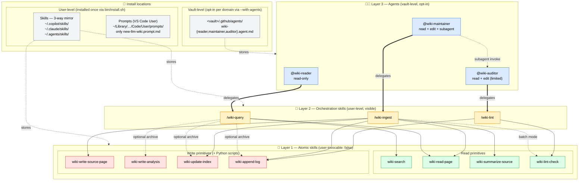

# ADR-0012: Convert `/wiki-ingest`, `/wiki-lint`, `/wiki-query` to orchestration skills; agents delegate to skills

## Status
Accepted (2026-07)

## Context

Post-ADR-0009 (Model D) + ADR-0010 (`wiki-detect-vault` elimination), the architecture had:

- 4 user-level slash-command **prompts**: `/new-llm-wiki`, `/wiki-ingest`, `/wiki-lint`, `/wiki-query`
- 8 user-level **atomic skills** (composable primitives, no visibility control)
- 3 optional vault-level **agents** with workflows composing atomic skills directly

Two structural issues surfaced during pilot use of the dev-second-brain vault:

**Issue 1: Prompt vs skill overlap for verb rituals.** Under the Agent Skills open standard ([agentskills.io](https://agentskills.io)), `/wiki-ingest` etc. could equally well be skills. Skills have strict advantages over prompts in our context:

| Aspect | Prompt (`.prompt.md`) | Skill (`SKILL.md`) |
|---|---|---|
| Slash-command | ✅ | ✅ |
| `argument-hint` in UI | ✅ | ✅ |
| Auto-invocation from natural language | ❌ | ✅ (description matching) |
| Composable (agents/skills call by name) | ❌ | ✅ |
| Cross-tool portability (Copilot CLI, Claude Code, 40+ others) | ❌ (VS Code Chat only) | ✅ (open standard) |
| Runtime visibility control (`user-invocable`, `disable-model-invocation`) | N/A | ✅ (in Chat; CLI ignores) |

Keeping both mechanisms would mean workflow duplication with no benefit; keeping only prompts loses composability + portability.

**Issue 2: Agent-body workflows duplicated the (future) orchestration skill workflows.** Each of `@wiki-{reader,maintainer,auditor}` had a numbered workflow in its body that was ~30 lines of near-identical logic with what `/wiki-{query,ingest,lint}` would express as a skill. If both existed, a workflow bug would need fixing in 4 places (skill + 3 agent bodies).

**Issue 3: UX clutter in `/` menu.** Under the previous plan, atomic skills (`wiki-search`, `wiki-read-page`, `wiki-summarize-source`, `wiki-write-source-page`, `wiki-write-analysis`, `wiki-update-index`, `wiki-append-log`, `wiki-lint-check`) would appear in Copilot Chat's `/` picker alongside the verb slash-commands. Users would see 11+ wiki-* entries and have to figure out which one to invoke — noise for internal primitives that are meant to be composed, not invoked directly.

## Decision

**Adopt a 3-layer skill/agent architecture:**

```
Layer 3 — Domain personality (vault-level, optional)
  @wiki-reader / @wiki-maintainer / @wiki-auditor
  ↓ delegate to
Layer 2 — Orchestration skills (user-level, visible in / menu)
  /wiki-query / /wiki-ingest / /wiki-lint
  ↓ compose
Layer 1 — Atomic skills (user-level, hidden from / menu)
  wiki-search, wiki-read-page, wiki-summarize-source,
  wiki-write-source-page, wiki-write-analysis,
  wiki-update-index, wiki-append-log, wiki-lint-check
```

**Concretely:**

1. **Delete prompts `/wiki-ingest`, `/wiki-lint`, `/wiki-query`.** Keep only `/new-llm-wiki` (pre-vault scaffolder; no vault context to inherit from).
2. **Create 3 orchestration skills** at `skills/wiki-{ingest,lint,query}/` with default visibility (no hiding flags). Same slash-command UX (`/wiki-ingest raw/foo.md`), same body workflow as the deleted prompts.
3. **Hide 8 atomic skills** with `user-invocable: false` in their SKILL.md frontmatter. They stay callable by explicit name from orchestration skills and agents, but disappear from the `/` picker in VS Code Chat.
4. **Refactor the 3 agent templates** to delegate to the corresponding orchestration skill instead of restating the workflow inline. Agent bodies become:
   - `## Constraints`: domain personality rules
   - `## Delegation`: "apply the wiki-{query,ingest,lint} skill"
   - `## When to override (inline handling)`: escape hatch for cases the skill can't express
   Frontmatter (tools + agents) unchanged from previous Phase C+++.

5. **Install-time cleanup**: `install.sh` and `install.ps1` add a `LEGACY_WIKI_PROMPTS` array containing `wiki-{ingest,lint,query}.prompt.md`; on install, these files are removed from `VS Code User/prompts/` if present from a previous version.

### Visual reference



Composition summary:
- `/wiki-query` → wiki-search + wiki-read-page (always) + wiki-write-analysis + wiki-update-index + wiki-append-log (opt-in with `--archive`)
- `/wiki-ingest` → wiki-summarize-source + wiki-write-source-page + wiki-read-page (cross-refs) + wiki-update-index + wiki-append-log (always) + wiki-lint-check (batch mode only)
- `/wiki-lint` → wiki-lint-check (JSON + MD) + wiki-append-log

## Consequences

**Positive:**

- **Portability**: `/wiki-*` slash-commands now work in Copilot CLI + Claude Code + any Agent Skills–compatible runtime (previously VS Code Chat only).
- **DRY**: workflow logic in one place (the orchestration skill), not duplicated in agent bodies.
- **UX cleanup**: `/` picker in Chat shows only the 3 verb entries (`wiki-ingest`, `wiki-lint`, `wiki-query`) + `/new-llm-wiki`, not the 8 internal primitives.
- **Cross-tool composability**: OpenSpec or any other Agent Skills consumer can call `wiki-search`, `wiki-read-page`, etc. by name — the skill catalog is public/documented; only `/` picker visibility is hidden.
- **Fewer places to fix workflow bugs**: single source of truth in the orchestration skill body.
- **`Argument-hint` uniformity**: skills carry `argument-hint` for UI (same as prompts did).

**Negative:**

- **Copilot CLI limitation**: `copilot skill list` still shows all 11 wiki-* skills — CLI ignores the `user-invocable: false` flag (as of 2026-07 per [docs.github.com/copilot/how-tos/copilot-cli/customize-copilot/add-skills](https://docs.github.com/en/copilot/how-tos/copilot-cli/customize-copilot/add-skills), only `name`, `description`, `license`, `allowed-tools` are supported). Chat gets the clean UX; CLI shows the full list. Acceptable trade-off pending upstream fix.
- **Agent bodies lose fine-grained step-by-step intercept.** Previously an agent could enforce domain rules between individual atomic skill invocations (e.g., "redact PII AFTER `wiki-summarize-source` but BEFORE `wiki-write-source-page`"). Now the orchestration skill runs those steps atomically; the agent's domain lens applies to the whole delegated execution, not step-by-step. Mitigated by the auto-loaded `.github/instructions/wiki-conventions.instructions.md` (already loads on any `wiki/**` file edit regardless of who orchestrates) and the `## When to override` escape hatch (agent can bypass the skill for cases needing fine-grained control).
- **Partial reversal of ADR-0007** ("Ingest & lint remain prompts"). ADR-0007 was written before the Skills ecosystem stabilized; its concerns (argument hints, structured invocation) are now covered by skill's own `argument-hint` field. See ADR-0007 erratum.
- **Partial reversal of ADR-0004** view of agents. ADR-0004 described agents as workflow-complete artifacts. They're now domain-personality layers on top of skills. See ADR-0004 erratum.
- **YAML frontmatter fragility**: descriptions containing `:` must be quoted. Discovered during pilot (`wiki-lint` had `(twice: MD for human report ...)` unquoted → YAML parse error in Copilot CLI). Skill-author guidance now documented in the SKILL.md template + install verification.

## Testing / validation performed

End-to-end pilot on dev-second-brain vault (learning domain):
- `/wiki-ingest raw/references/pages/...md` from VS Code Chat: orchestration skill fires, atomic skills compose correctly, source page + cross-refs + index + log all written.
- `/wiki-lint`: full 7-check audit runs, MD report + JSON parse + auto-repair frontmatter fixes applied, log appended.
- `/wiki-query "..."`: search + read-page chain composes, synthesizes with `[[wikilink]]` citations, optional archival via `--archive`.
- Copilot CLI: `/wiki-*` slash-commands discovered and invoked correctly. Atomic skills visible in `skill list` (CLI gap — see Negatives above) but composition via orchestration skills works.
- Vault-level agents (`@wiki-{reader,maintainer,auditor}`): delegate to orchestration skills successfully; `## When to override` reserved for domain edge cases.

## Alternatives considered

**A. Keep prompts, add orchestration skills alongside for CLI/composability.** Rejected: duplicates the workflow definition in two files; picker ambiguity (`/wiki-ingest` = prompt or skill?); doubles the fix surface for workflow bugs.

**B. Merge `@wiki-maintainer` and `@wiki-auditor` into a single `@wiki-editor` agent for simpler picker UX.** Rejected: loses runtime-enforceable "safe audit mode" distinction, forces the merged body to cover two mental modes (edit vs review), reverses ADR-0004. Alternative middle path adopted: extend maintainer to invoke `@wiki-auditor` as subagent (or delegate to `wiki-lint`) for follow-up audits without merging roles.

**C. Prefix atomic skills with `_` or `zz-` for visual grouping instead of hiding.** Rejected: doesn't reduce picker clutter; only reorders. Actual hiding via `user-invocable: false` is the correct mechanism when supported (Chat) and gracefully falls back to full list when not (CLI).

## Follow-up

- Track the CLI gap on `user-invocable`/`disable-model-invocation` upstream ([microsoft/vscode-copilot-chat](https://github.com/microsoft/vscode-copilot-chat) — CLI is bundled there). If/when CLI honors these flags, the atomic skills auto-hide from `copilot skill list` too, no further action needed.
- Consider adding a `skill-author checklist` note to the repo's contributor docs: quote descriptions containing `:`, verify YAML frontmatter parses, run `bash bin/install.sh` on a scratch vault before PR.
- Revisit agent merge (Alternative B) after 3+ months of real use if `@wiki-auditor` standalone remains under-utilized.

## References

- [ADR-0004](0004-three-fixed-roles.md) — Three fixed roles (reader/maintainer/auditor). Now updated: roles are domain-personality layers, not workflow-complete artifacts.
- [ADR-0007](0007-ingest-lint-remain-prompts.md) — Ingest & lint remain prompts. Now superseded by this ADR for the `wiki-{ingest,lint,query}` triad; `new-llm-wiki` remains a prompt.
- [ADR-0009](0009-evaluate-user-level-vault-operational-customizations.md) — Model D (skills+prompts at user level, agents optional per vault).
- [ADR-0010](0010-eliminate-wiki-detect-vault.md) — Vault path from copilot-instructions.md.
- [ADR-0011](0011-skill-token-optimization-strategies.md) — Token optimization strategies (superseded by ADR-0010).
- [Agent Skills specification](https://agentskills.io) — open standard driving cross-tool portability.
- [VS Code Copilot Agent Skills docs](https://code.visualstudio.com/docs/copilot/customization/agent-skills) — `user-invocable` + `disable-model-invocation` behavior in Chat.
- [Copilot CLI Agent Skills docs](https://docs.github.com/en/copilot/how-tos/copilot-cli/customize-copilot/add-skills) — CLI subset of the spec.
